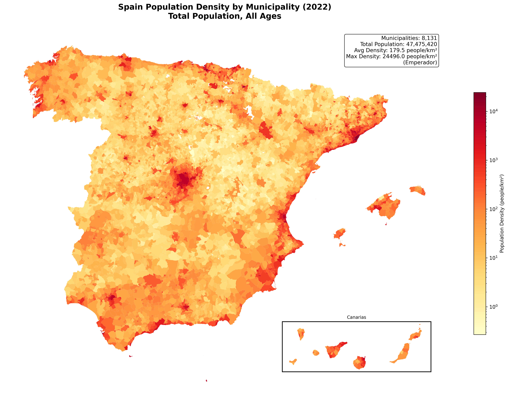
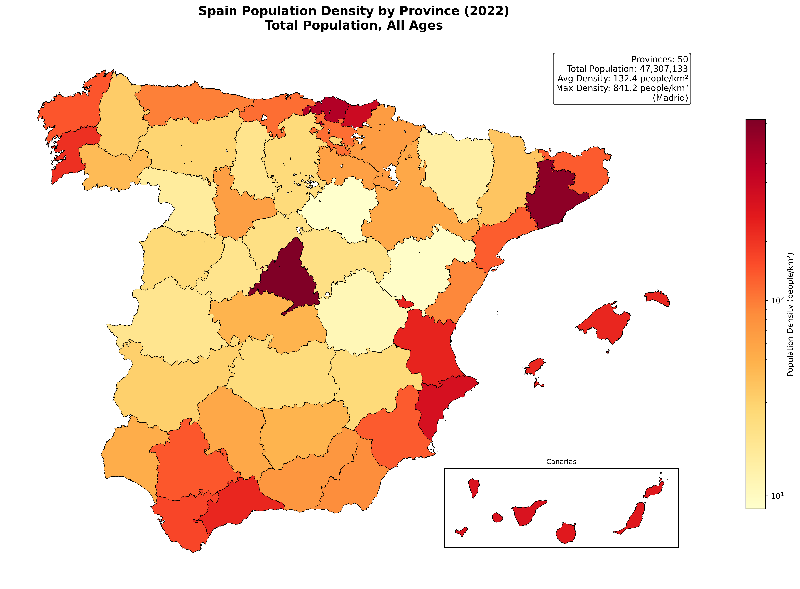
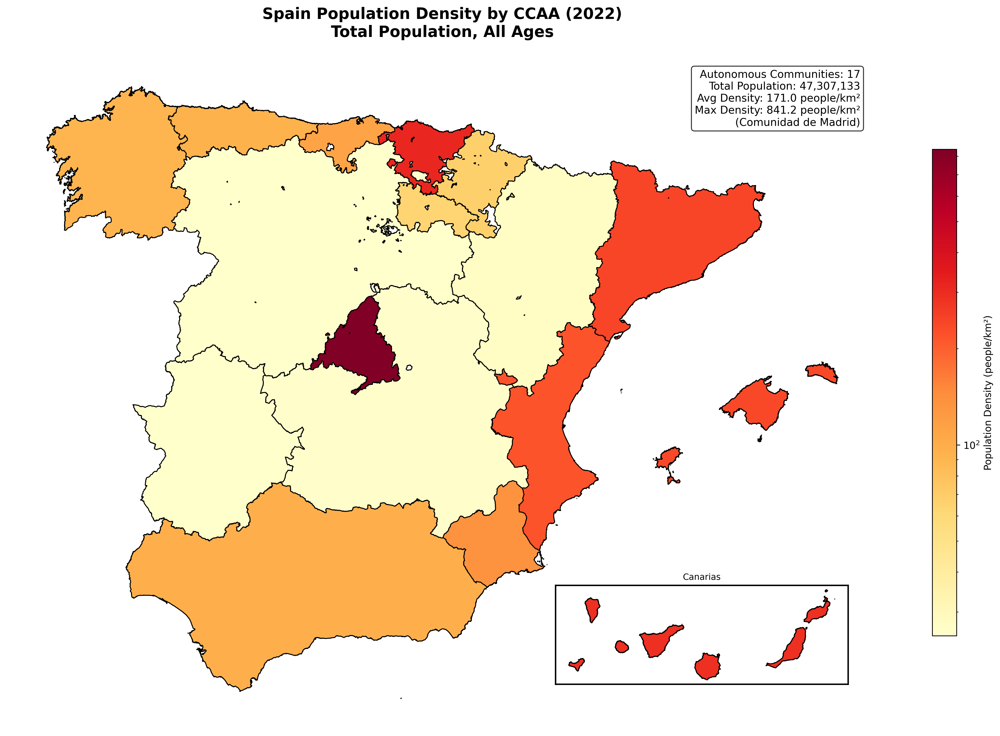
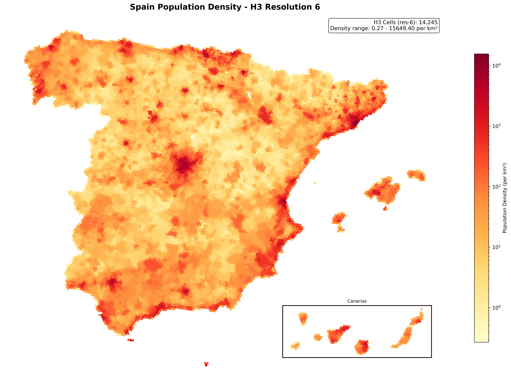

::: {.callout-note}
## Fase A — vista administrativa + H3
Esta es la primera de dos fases. La **Fase A** (aquí) responde *dónde vive la gente* a partir del
censo y el mapa. La **Fase B** añade las luces nocturnas de NASA Black Marble para validar *dónde,
dentro de cada municipio*, vive realmente. Construido y ejecutado sobre Databricks Free Edition
serverless.
:::

## La pregunta

El registro de población de España, el [Padrón Continuo del INE](https://ine.es), se publica por
*municipio* — y los municipios son enormemente desiguales en tamaño. Madrid es un polígono; también
lo es una aldea de 12 personas en Soria. Pregunta "¿dónde vive realmente la gente?" con datos
municipales en bruto y el mapa miente: te habla de fronteras administrativas, no de personas.

## El hallazgo

La mentira es medible. Toma la densidad de población (habitantes por km², calculada sobre una
proyección de igual área) de cada municipio español en 2022:

| Medida | hab. / km² |
|---|---|
| Municipio mediano | **13** |
| Municipio medio | 180 |
| **La densidad del *español medio*** (ponderada por población) | **2.508** |

La mitad de los municipios de España están por debajo de **13 hab./km²** — el interior vacío, *la
España vaciada*. Y sin embargo el español típico vive a unos **2.500 hab./km²**. La persona típica
vive, por tanto, en un entorno unas **187×** más denso que el municipio típico (la mediana) — y unas
**14×** más denso que el municipio *medio* (180). Un mapa coloreado por municipio te enseña tierra
vacía; no te enseña dónde vive el país.

## Cuatro vistas de los mismos 47,5 millones de personas

La misma población, dibujada en cuatro unidades distintas. Observa cómo se afina la historia a
medida que la unidad espacial se vuelve más honesta.

### Por municipio (~8.100 unidades)


### Por provincia (50 unidades)


### Por comunidad autónoma (17 unidades)


### Sobre una rejilla H3 uniforme (hexágonos de igual área)
Las unidades administrativas comparten un defecto: varían en tamaño y forma, así que el color
codifica en parte la *geografía* en lugar de la *densidad*. Uber [H3](https://h3geo.org) las
reemplaza por hexágonos de igual área, de modo que el color significa lo mismo en todo el territorio
— y el mapa de población y el de densidad pasan a ser el mismo mapa.



## Cómo está construido

Un pipeline sobre Databricks — sin servidor GIS, solo Databricks SQL + las funciones espaciales nativas:

1. **Unir** la población del Padrón del INE a los límites municipales del IGN por el código INE de
   5 dígitos (8.131 municipios cruzados limpiamente; los extras del conjunto de límites son
   entidades territoriales no municipales y enclaves en disputa, reconciliados a la unidad).
2. **Densidad**, con honestidad — reproyectar al CRS de igual área ETRS89 / LAEA (EPSG:3035) y
   dividir población entre km² reales. La densidad no es aditiva, así que se recalcula (no se
   promedia) en cada nivel al disolver hacia provincia y CCAA.
3. **Asignación H3** — rellenar (*polyfill*) cada municipio a celdas res-9 y repartir su población
   entre ellas, luego agregar a res-6 para la vista nacional. La población se conserva de forma
   exacta: los 3 municipios que el *polyfill* deja sin celda se rescatan asignándolos a la celda H3
   de su centroide, de modo que no se pierde ni una persona.

```sql
-- Asignar la población municipal a celdas H3 (h3_* nativo de Databricks),
-- simplificando la geometría primero para que el polyfill sea barato sobre fronteras detalladas.
SELECT  h3_toparent(cell, 6)                         AS h3_cell,
        SUM(poblacion / num_cells)                   AS poblacion
FROM (
  SELECT  codigo_municipio, poblacion,
          explode(h3_polyfillash3string(ST_AsWKT(ST_Simplify(geometry, 0.001)), 9)) AS cell,
          size(h3_polyfillash3string(ST_AsWKT(ST_Simplify(geometry, 0.001)), 9))     AS num_cells
  FROM    municipios_geo
)
GROUP BY h3_toparent(cell, 6)
```

## Qué viene — Fase B

El mapa H3 todavía asume que la población se reparte *de forma uniforme* dentro de cada municipio.
No es así. La **Fase B** incorpora las luces nocturnas de NASA Black Marble (VIIRS) para reasignar
la población según el brillo de cada celda — convirtiendo "donde el registro dice que está la gente"
en "donde las luces demuestran que está". Ese es el validador, y el hilo publicado, todavía por
llegar.
